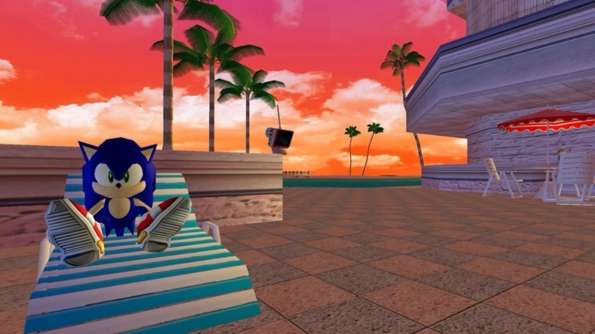

# 🌌 MiniG — Киберспортивный Сборник Настольных Игр

<div align="center">
  
  <p><em>Супер-заряженный пати-гейм сборник для настоящих дотеров и киберспортсменов. Эстетика Liquid Glass, неон и угарные локальные мемы прямо на твоём смартфоне!</em></p>
</div>

---

## ✨ Эстетика и Дизайн-Система: Gorilla Glass & Liquid Glass
Приложение MiniG выглядит премиально и футуристично, погружая в атмосферу ночного неонового клуба:
* **Frosted Glass**: Полупрозрачные матовые стеклянные карточки с размытием заднего фона (рендер-эффекты размытия).
* **Neon Glow**: Яркие светящиеся неоновые контуры активных элементов (Cyan 🔵, Magenta 🔴, Neon Green 🟢, Neon Yellow 🟡).
* **Space Background**: Динамическое глубокое космическое небо с плывущими частицами пыли и эффектом параллакса при наклоне устройства.
* **Micro-animations**: Пружинные анимации интерфейса с тактильным откликом (Haptic Feedback) на каждое нажатие.

---

## 🎮 Игровые Модули

### 1. 📢 Дотерский Alias («Рекрут»)
Культовая игра на объяснение слов, полностью адаптированная под дотерский сленг и мемы!
* **База слов**: `Rekrut.json` (905 уникальных киберспортивных терминов и сленговых фраз).
* **Случайные команды**: `AliasCS.json` (202 уморительных названия дотерских команд с генератором названий).
* **Управление жестами**: Свайп карточки **вверх** — угадано (зеленый шлейф), свайп **вниз** — пропуск (красный шлейф).
* **Настройки под себя**: Тонкая регулировка времени раунда, целевых очков и включения/выключения штрафов за пропуск.

---

### 2. 🕵️‍♂️ Дотерская Мафия (Dota Mafia)
Классическая психологическая игра «Мафия», перенесённая в противостояние Сил Света и Сил Тьмы:
* **Ролевой состав с кастомными картами**:
  * 😈 **Night Stalker (Мафия)** — Активный убийца.
  * 🕵️ **Bounty Hunter (Мафия/Шпион)** — Вспомогательный убийца.
  * 🛡️ **Silencer (Блокировщик)** — Блокирует ночные способности.
  * 🔎 **Legion Commander (Комиссар)** — Ночью проверяет альянс игроков.
  * 🩺 **Omniknight (Доктор)** — Исцеляет игроков ночью.
  * 🥩 **Pudge (Мирный житель)** — Простой житель без способностей.
* **Умные механики**:
  * **🤐 Заглушка Сайленсера**: Если Сайленсер блокирует Комиссара, тот получает результат **«НЕ ЗНАЮ»** вместо фракции проверяемого.
  * **🤐 Блокировка голосования**: Голос заблокированного Сайленсером игрока не учитывается на дневном голосовании, а в режиме игры без ведущего он автоматически пропускает свою очередь.
  * **Режим без ведущего (телефон по кругу)**: Включает фейковые действия для мирных Пуджей (7-секундный таймер на «задумчивое лицо»), чтобы никто не вычислил мафию по скорости тапов.
  * **Режим с ведущим (Host Mode)**: Телефон выступает в роли удобного дашборда для ведущего с автоматическим расчётом ночных результатов.

---

### 3. 🎯 Контракт на Смерть (Dota Killer)
Реальный киллер-ассасин прямо на вашей тусовке:
* **Игровой цикл**: Приложение выстраивает тайную замкнутую цепочку контрактов. Каждый участник видит имя своей жертвы и секретную фразу из файла `Killer.json` (542 дотерские фразы).
* **Ликвидация**: Задача киллера — заставить жертву произнести кодовую фразу в обычном разговоре.
* **«Раскусил!» (Контратака)**: Если жертва поняла, что её пытаются убить кодовым словом, она может произнести «Ты киллер!» и отправить нападавшего в таверну, перехватив его контракт.
* **Попытки смены фразы**: До 3 попыток реролла сложной фразы на раунд.

---

### 4. 📝 Скрытый Драфт (Hidden Draft)
Интеллектуальная карточная стратегия на сбор идеального пика героев:
* **Скрытые личности**: Игроки получают секретные роли популярных героев Доты из 8 различных фракций (всего 240 уникальных персонажей без повторений!).
* **Драфт**: За 7 минут игроки должны вживую договориться и выбрать ровно 5 героев в общий пик, при этом каждый обязан тайно лоббировать интересы своего персонажа.
* **Проверка контрактов**: Алгоритм автоматически сверяет финальный драфт с условиями победы персонажей (например, протащить Пуджа, взять 3 милишников для Течиса, или поддержать выбор предыдущего игрока для Ио).

---

## 🛠️ Технологический Стек приложения
* **Core**: Kotlin, Coroutines, Flow.
* **UI**: Jetpack Compose.
* **Архитектура**: MVVM (Model-View-ViewModel).
* **База данных**: Room (SQLite) для автосохранения состава лобби, настроек, текущих контрактов киллера и логов мафии.
* **Сериализация**: Gson / Kotlinx.serialization.
* **Изображения**: Coil с каскадной системой поиска медиа-ресурсов (Assets -> Внутренняя память -> Drawables -> Fallback на Steam dota2.com CDN).

---

## 📦 Сборка и Установка

### Требования
* **JDK**: Версия 21.
* **Android SDK**: API 36 (Android 16).
* **Gradle**: Версия 9.3.1.

### Компиляция через терминал (Windows PowerShell)
1. Установите переменную `JAVA_HOME` на вашу JDK 21 (например, из Android Studio):
   ```powershell
   $env:JAVA_HOME="C:\Program Files\Android\Android Studio\jbr"
   ```
2. Соберите отладочный и релизный APK-файлы:
   ```powershell
   .\gradlew.bat assemble --no-daemon
   ```
3. Готовые файлы будут лежать по путям:
   * **Релизный APK (signed)**: `app/build/outputs/apk/release/app-release.apk`
   * **Отладочный APK**: `app/build/outputs/apk/debug/app-debug.apk`

---

## 🔐 Подпись Приложения
Проект поставляется с настроенной автоматической подписью:
* **Release-сборка** подписывается сгенерированным ключом `my-upload-key.jks` (пароль: `password`, алиас: `upload`).
* **Debug-сборка** автоматически подписывается `debug.keystore`.

---

<div align="center">
  <p><b>Разработано для настоящих геймеров. Тащите катки IRL! 🚀</b></p>
</div>
